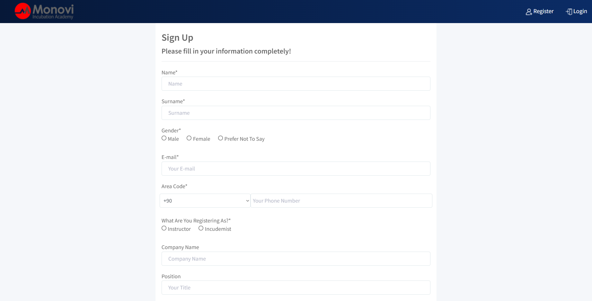
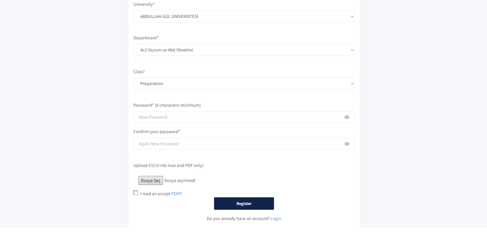

# Monovi Incudemy Register Page
## Incudemy Training Site Front-End and Back-End Software Development
It is the user registration page of a Incudemy training site that I started and developed during my internship at Monovi Information Technologies.
I stored user information using MSSQL and MySQL technologies and I pulled information such as university, department, class from the database.
I created the interface of the user registration page using Asp.Net MVC and C# technology, HTML, CSS, JAVASCRİPT information.

This training site includes;
* You can register on this site as an Instructor (Teacher) or a Incudemist (Student), receive training or give training.
* Users registered as Instructors (Teachers) will be able to open tutorials, create surveys, take quizzes and issue certificates to incudemists.
* The Incudemist (Student), on the other hand, will be able to receive training, participate in exams and surveys, send feedback and obtain a certificate if requested.

---

## :file_folder: Register Page
You can reach the user registration page I made by clicking [here](http://incudemy.monovi.com.tr/Auth/UserAdd)!

## :warning: Technologies used

- [Asp.Net Core MVC](https://dotnet.microsoft.com/en-us/apps/aspnet)
- [C#](https://docs.microsoft.com/en-us/dotnet/csharp/)
- [MySQL](https://www.mysql.com)

## 🚀 Installation

Clone the repo, download this project and open the sln file.

```bash
git clone https://github.com/bertuginal/Incudemy-project
```

## :point_down: Images

<div align="center"></div>
<div align="center"></div>
<div align="center"></div>

## :clap: And it's done!
For questions or comments, you can contact me via this e-mail :email: bertuginal@yahoo.com
